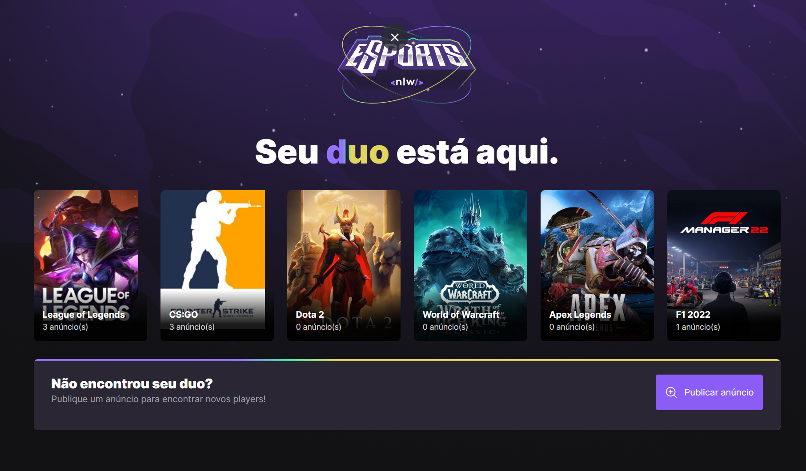

# NLW Esports
Projeto no qual a finalidade é encontror o seu DUO para jogar, desenvolvido no evento NLW da Rocketseat, no qual contamos com a versão web e mobile, além da contrução do backend  

## Tecnologias

Esse projeto foi desenvolvido com as seguintes tecnologias:

### Frontend Web
- TypeScript
- Tailwind CSS
- React
- Vite  

### Backend
- TypeScript
- Node
- SQLite
- Prisma

### Mobile
- React Native
- Typescript  

## Run Locally

### Web
~~~bash
$ npm run dev
~~~

### Backend
~~~bash
$ npm run dev
~~~

### Mobile
~~~bash
$ npx expo start
~~~

